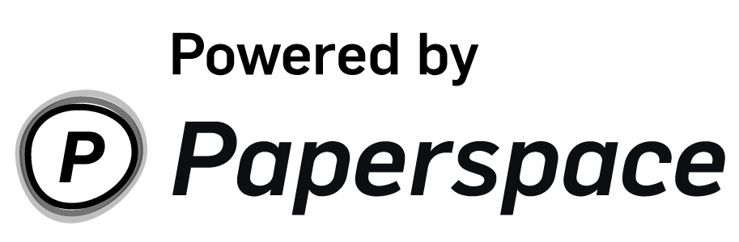

# CS396/496: Deep Learning For Practitioners @ NU

## Course communication

As the course is now mostly remote, we’re gonna have to do things a bit differently. There are three main ways that we’ll be communicating: Slack, Video Calls, and Canvas (mostly just for submitting assignments).

I’ve created a Slack for the course. You should have an email in your Northwestern-associated inbox with a link to sign up.

I’ve decided the best way to do things is to have active Slack discussions + video calls about papers/code/etc. We’ll have designated times to sign on and discuss these things. Slack participation will be very important. I’ll also set up a video call that will be in parallel with the Slack discussion. This is to facilitate both poor-internet and good-internet scenarios, depending on what your work-from-home situation is right now. If your work-from-home situation isn’t great, please message me and we can discuss how to make things work. But you must join the Slack and be active on it. That’s the best way to make this class work and for everyone to get the most out of it. You’ll learn the most from good discussion more than lecture! I recommend downloading the desktop app to stay connected and not just using a browser tab.

We will have both synchronous as well as asynchronous components to this course. Synchronous components will take the form of weekly discussions at a designated time: **Wednesdays from 2-5PM CDT (Chicago time)**. You must be on time for the synchronous component! The asynchronous component will in the form of Slack discussions, offline group meetings that you set yourself, and office hours with me, by appointment.

## Paper/topic/code presentations

A big component of this course is paper AND code presentations. We’ll be doing paper discussions and deep dives into code every week. Each week, two groups (2 people per group) will be asked to present a paper (or general topic, like transformers) + code-base each. What paper/topic and what code-base you present is up to you, but I’ll provide a list of topics I think would be interesting. 

Each presentation will have three components: 

- Dissemination of supporting material such as slides, code, notebooks, papers, blogposts, etc. This will happen asynchronously and can be iterated on as much as you want. If you improve materials after your presentation, please let the class know on Slack, with links! The goal is to come up with a very clean explanation of a topic you care about, which takes iteration. 
- Presentation and discussion synchronously via Slack and video call. After the presentation, there will be Q&A, via Slack or video call. If a question comes up that you have to think about, you can answer it on Slack later. Each week of the course will have a Slack channel dedicated to it. Please show up on time for synchronous discussion.
- Scribe: Two people will be assigned to be the scribe for each week, one for each presentation. The scribe should note down any questions, the answers given, and any other notes for the presenters. The presenters should then take this into account and improve their supporting materials.

I’ll be doing the first presentation (this week), which will be focused around a few landmark papers in using deep learning for computer audition, along with a code-base I wrote myself. This first presentation will show you the level of effort I expect each week from everyone. There is a course web-page here: https://pseeth.github.io/deep-learning-for-practitioners/. Your material should be PRed (pull-requested) into that repository after you present, along with notes from the scribe. If you used slides you found online, please upload the PDF in your PR, not just the link to the slides.

## Projects

Projects are an important component of this course. We will split into groups of 3 or 4, depending how things work out. Independent projects are not encouraged as I simply will be stretched too thin to help out if everyone does that! 
The focus of this course is to build code-bases that reproduce papers you are interested in. If a paper reports N numbers, ideally your code-base should reproduce those results as much as possible If you cannot reproduce a paper, it's okay, but we need to thoroughly document why that happened! At the end of your project, you will write two documents:

- Tips and tricks for training X: a document consisting of any things you had to take care of when implementing the paper. Every deep learning project has a bunch of stuff that goes wrong while implementing it, often with bizarre effects. Every time something goes wrong, you should write down what went wrong and how you fixed it in this document. This should be a living document that grows as your project continues on.
- Reproducibility report: a document that describes your attempts at reproducing the main results from the paper. This should be a final report summarizing all of your efforts to reproduce the paper and what were the key parts to doing so or hypotheses as to why you could not do so.

To facilitate better code and consistent effort, we will be doing code reviews. Each group will review one other group’s code each week. To train the model for real on a lot of GPUs, I will use something like https://github.com/goerz/tmuxpair to give you access to a machine. This will be towards the end of the course, unless the code-reviews suggest that your code-base is ready to scale up to a large dataset early on. To test your code before that point, you can write good test cases on your own computer. To test things on a GPU, you can use Paperspace GPUs, or Colab GPUs. Once I’m convinced things work, we’ll run it for real.

The code-base I present this week will show the quality of the code I expect from everyone. Good code takes consistent effort and careful thought. The code-base I will be presenting took me around 7-8 weeks to get completely up to scratch, tested, and reproducing SOTA results. This is not easy, so rushing the code the week the last week before will not do.

Finally, some of the work you do in this course might be paper-able. If that’s the case, then I’m happy to continue on to help with getting it published! Or, you of course own your own code and can do whatever you want with it and publish on your own. Regardless, I hope this course helps with your goals!

All further communication will be done via Slack! Welcome to the course, and thanks for signing up!

## A note on grading

I took this from Jason Wilson's course syllabus. I'll be following this policy as well.

> I am not focused on grades this quarter.  First and foremost, I want everyone to be happy, healthy, and safe.  Second, I want you all to focus on learning what you want and what you can and not be stressed about grades.  Lastly, this is going to be a bumpy ride, full of hiccups and mistakes.  Let's just try to do the best we can.
>
> For undergraduate students, all Spring Quarter courses are Pass/No Pass.  Students will get a Pass if they try to participate in most course activities (i.e., discussions, presentations, group project).
>
> For graduate students, I am still mostly thinking of this as Pass/No Pass.  Similar to undergraduates, my expectation of graduate students is to try to participate in all activities.  Of course, as graduate students, I hope your contributions to be more substantial (i.e., higher quality and more in depth). 

## Materials

### Week one

- [Deep clustering](https://arxiv.org/pdf/1508.04306.pdf)
- [Alternative objective functions for deep clustering](https://www.merl.com/publications/docs/TR2018-005.pdf)

And here’s the codebase:

- [nussl](https://github.com/interactiveaudiolab/nussl/tree/refactor)
- [loss function implementation](https://github.com/interactiveaudiolab/nussl/blob/refactor/nussl/ml/train/loss.py#L66)

We’ll also read one additional paper and discuss it both this week and next week:

- [reproducibility of machine learning research](https://papers.nips.cc/paper/8787-a-step-toward-quantifying-independently-reproducible-machine-learning-research.pdf)

I’ll also be handing out a “deep learning quickstart” assignment this week for everyone to do, on their own. This simple assignment will just get you into the groove of writing code, tests, and doing experiments on some simple models with MNIST, so you can train it on your laptop. I’ll send around the link very soon via Canvas.

### Week two

- [gradient-based debugging](https://colab.research.google.com/drive/19OQ7Y4D959XxbrMA1rCIJJDAPhvxu3wv#scrollTo=mW5loG061-Sz)
- [nussl project structure](https://github.com/nussl/models)
- [nussl deep learning tests](https://github.com/nussl/nussl/blob/master/tests/ml/test_loss.py)
- [test by overfitting](https://github.com/nussl/nussl/blob/master/tests/ml/test_overfit.py)
- [have a debugging pipeline](https://github.com/nussl/models/blob/master/main.py#L56)
- [don't have to roll your own training tools](https://github.com/pytorch/ignite)
- [reproducibility of machine learning research](https://papers.nips.cc/paper/8787-a-step-toward-quantifying-independently-reproducible-machine-learning-research.pdf)

### Week three

- [Deep Learning and Information Bottleneck Principle](https://arxiv.org/pdf/1503.02406.pdf)
- [Estimating Information Flow in Deep Neural Networks](http://proceedings.mlr.press/v97/goldfeld19a/goldfeld19a.pdf): Includes experiments conducted by IBM researchers
- [The HSIC Bottleneck: Deep Learning without Back-Propagation](https://arxiv.org/pdf/1908.01580.pdf): Another experiemnt using alternative methods

Codebase (HSIC trainning with PyTorch)

- [HSIC-bottleneck](https://github.com/choasma/HSIC-bottleneck/)

Some supplementary materials:

- [Lecture notes for information theory](http://homepage.ntu.edu.tw/~ihwang/Teaching/Fa16/IT.html): Related notes: Lec. 1, 4 
- [Information theory and machine learning](https://www.cs.cmu.edu/~aarti/Class/10704_Spring15/): Related notes: Lec. 16
- [Measuring Statistical Dependence with Hilbert-Schmidt Norms](http://www.gatsby.ucl.ac.uk/~gretton/papers/GreBouSmoSch05.pdf): More on HSIC related math

### Week four

#### Poincaré Embeddings for Learning Hierarchical Representations (KJ and Zane)

- [Paper](https://arxiv.org/pdf/1705.08039.pdf)

- [Codebase](https://github.com/facebookresearch/poincare-embeddings)

- [Neural Network Embeddings (background information)](https://towardsdatascience.com/neural-network-embeddings-explained-4d028e6f0526)

- [What is Hyperbolic Geometry? (background information)](http://www.math.tifr.res.in/~mahan/rnl.pdf)

- [Supplemental presentation by one of the authors of the paper](https://cds.cern.ch/record/2306315)

#### Feature-wise Transformations: A simple and surprisingly effective family of conditioning mechanisms (Ari)
- [Interactive paper](https://distill.pub/2018/feature-wise-transformations)
- [Code for FiLM, the main focus of the paper](https://github.com/ethanjperez/film/blob/master/vr/models/filmed_net.py#L209)
- [Presentation Slides](https://docs.google.com/presentation/d/1fhXyW1vivQe8Ku-1o59HmmevjbxIhBzpcxKfqJZK3Ag/edit?usp=sharing)
##### Supplementary materials
 - [The original FiLM (2017) paper](https://arxiv.org/pdf/1709.07871.pdf), if you want a more technical explanation 
 - [Further description of feature-wise conditioning](https://towardsdatascience.com/conditional-love-the-rise-of-renormalization-techniques-for-neural-network-conditioning-14350cb10a34) with more context on its relationship to batch normalization and other DL techniques
   - I'd highly recommend this resource, especially if some parts of the presentation were unclear!
 - Fun thing! [Play around with GauGAN](https://www.nvidia.com/en-us/research/ai-playground/) (scroll down a bit), which uses feature-wise conditioning, to get a better feel for the power of conditioning :sparkles:
    - Concise description of GauGAN implementation [here](https://nvlabs.github.io/SPADE/)
    

### Week five
 
#### StyleGAN and StyleGAN2 (David, Joshua, and Thomas)
 StyleGAN:
 - [Paper](https://arxiv.org/pdf/1406.2661.pdf)
 - [Codebase](https://github.com/NVlabs/stylegan)
 - [Supplemental video](https://youtu.be/kSLJriaOumA)
 
 StyleGAN2:
 - [Paper](https://arxiv.org/pdf/1912.04958.pdf)
 - [Codebase](https://github.com/NVlabs/stylegan2)
 - [Supplemental video](https://youtu.be/c-NJtV9Jvp0)
 - [15 minutes of face interpolations w/ StyleGAN2](https://www.youtube.com/watch?v=6E1_dgYlifc)

#### Batch Normalization
* Original Paper: [Batch Normalization: Accelerating Deep Network Training by Reducing Internal Covariate Shift](https://arxiv.org/pdf/1502.03167.pdf)
* Andrew Ng Videos
  * [Normalizing Activations in a Networks](https://www.youtube.com/watch?v=tNIpEZLv_eg)
  * [Why does batch normalization work?](https://www.youtube.com/watch?v=nUUqwaxLnWs)
  * [Batch norm at test time](https://www.youtube.com/watch?v=5qefnAek8OA)
* Presenting Paper: [How Batch Normalization Works](https://arxiv.org/pdf/1805.11604.pdf)
  * [Overview Video](https://youtu.be/ZOabsYbmBRM)
* [PyTorch source code for Batch Norm](https://pytorch.org/docs/stable/_modules/torch/nn/modules/batchnorm.html#BatchNorm2d)

### Week Six

#### AutoGAN
* [Paper: AutoGAN](https://arxiv.org/abs/1908.03835)
* [Code](https://github.com/TAMU-VITA/AutoGAN)
* [Presentation](https://drive.google.com/file/d/1bD2eyPmuI7zVdjwdbBl96-sDv0FIYTbi/view?usp=sharing)  
* Supplement Material
  * [Progressive Growing of GANs](https://arxiv.org/pdf/1710.10196.pdf)
  * [Neural Architecture Search with Reinforcement Learning](https://arxiv.org/abs/1611.01578)
  * [Progressive NAS](https://arxiv.org/pdf/1712.00559.pdf)
  
### Universal Language Model Fine Tuning (ULMFiT)
* [Original Paper](https://arxiv.org/pdf/1801.06146.pdf)
* [Link to presentation](https://docs.google.com/presentation/d/15FymkSvt4srHr4DKywgl6ywTgBxy2a9_RK2P-rjTlQM/edit?usp=sharing)
* [Code from our presentation](https://github.com/jackbandy/deep_learning_ulmfit)

* [FastAI/ULMFiT Support Forum](https://forums.fast.ai/c/part2-v2/)
* [ULMFiT Video tutorial](https://www.youtube.com/watch?v=vnOpEwmtFJ8&feature=youtu.be&t=4511)
 * [Notebooks used in tutorial](https://github.com/fastai/course-v3/tree/master/nbs/dl2)
* [More Relevant FastAI notebooks](https://github.com/fastai/fastbook)
* [OpenAI's response paper](https://www.cs.ubc.ca/~amuham01/LING530/papers/radford2018improving.pdf)
 * [Colab notebook](https://colab.research.google.com/github/secsilm/awsome-colabs/blob/master/nlp/classification/TransferLearningNLP.ipynb)

### Week Seven

#### Learning to Learn How to Learn: Self-Adaptive Visual Navigation using Meta-Learning
* [Link to paper](https://arxiv.org/pdf/1812.00971.pdf)
* [Link to codebase](https://github.com/allenai/savn)
* [Presentation](https://docs.google.com/presentation/d/1PLIpbG2N854rPWIhyKf9HmusqsGChtfmPXJrEbrzRhg/edit?usp=sharing)

##### Supplement materials:
* [Deep Reinforcement Learning: Pong from Pixels](http://karpathy.github.io/2016/05/31/rl/)
* [Brief introduction to Meta Learning](https://medium.com/huggingface/from-zero-to-research-an-introduction-to-meta-learning-8e16e677f78a)
* [Learning to learning brief explanation](https://bair.berkeley.edu/blog/2017/07/18/learning-to-learn/)
* [Model-Agnostic Meta-Learning for Fast Adaptation of Deep Networks](https://arxiv.org/pdf/1703.03400.pdf)
* [Explanatory video by the author of MAML on the next generation of Robot Learning](https://www.youtube.com/watch?time_continue=711&v=tcFLwgqO7G0&feature=emb_logo)

#### Multivariate LSTM-FCNs for Time Series Classification
* [Link to paper](https://arxiv.org/pdf/1801.04503.pdf)
* [Link to codebase](https://github.com/titu1994/MLSTM-FCN)

##### Additional Papers
* [LSTM Fully Convolutional Networks for Time Series Classification](https://arxiv.org/abs/1709.05206)
* [Insights into LSTM Fully Convolutional Networks for Time Series Classification](https://arxiv.org/pdf/1902.10756.pdf)
* [Time Series Classification from Scratch with Deep Neural Networks: A Strong Baseline](https://arxiv.org/pdf/1611.06455.pdf)
* [Deep learning for time series classification: a review](https://arxiv.org/pdf/1809.04356.pdf)
* [Time-Series Classification with COTE: The Collective of Transformation-Based Ensembles](https://ieeexplore.ieee.org/stamp/stamp.jsp?tp=&arnumber=7069254)

### Week Eight

#### Unpaired Image-to-Image Translation using Cycle-Consistent Adversarial Networks
* [Link to paper](https://junyanz.github.io/CycleGAN/)
* [Link to codebase](https://github.com/junyanz/pytorch-CycleGAN-and-pix2pix)
  
##### Supplement materials:
* [Image-to-Image Translation with Conditional Adversarial Nets](https://phillipi.github.io/pix2pix/)
* [Unsupervised Image-to-Image Translation Networks](https://arxiv.org/abs/1703.00848)
* [A Neural Algorithm of Artistic Style](https://arxiv.org/abs/1508.06576)
* [Perceptual losses for real-time style transfer and super-resolution](https://arxiv.org/abs/1603.08155)

#### Waveglow
* [Link to paper](https://arxiv.org/abs/1811.00002)
* [Link to codebase](https://github.com/NVIDIA/waveglow)
* [Presentation Slide (draft) ](https://github.com/asadayuki/waveglow/blob/master/doc/Waveglow_presentation.pdf)
* [Code Analysis](https://github.com/asadayuki/waveglow/blob/master/doc/CodeAnalysis.pdf)
  
##### Supplement materials:
* [Flow-based Deep Generative Models](https://lilianweng.github.io/lil-log/2018/10/13/flow-based-deep-generative-models.html)
* [WaveNet: A generative model for raw audio](https://deepmind.com/blog/article/wavenet-generative-model-raw-audio)
* [Normalizing Flows Tutorial, Part 1: Distributions and Determinants](https://blog.evjang.com/2018/01/nf1.html)
* [Normalizing Flows: An Introduction and Review of Current Methods](https://arxiv.org/abs/1908.09257)

## Sponsors

Thanks so much to PaperSpace for supporting this course with GPU credits. Try PaperSpace [here](https://www.paperspace.com/).

